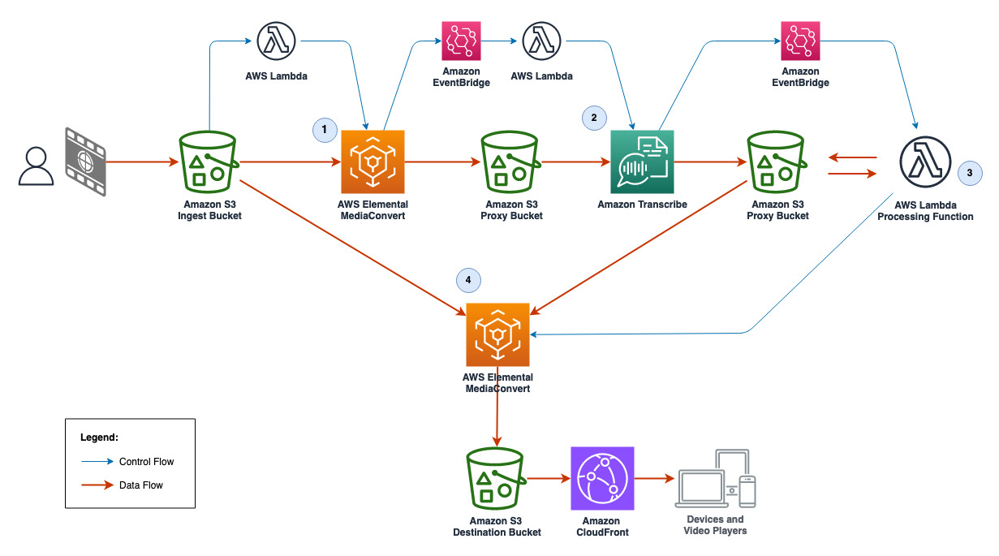

# Automate media content filtering with AWS

This sample code provides a demo workflow to filter profanities and swear words in video files. The output is an HLS video asset where profanities in the audio and produced subtitles are masked. In addition, the demo supports auto-detection of the video's language. 


## Architecture Diagram



### How it works
1. The user uploads a video file to Amazon S3 Ingest Bucket. Then AWS Elemental MediaConvert creates an audio proxy file.
2. Using a Vocabulary Filter, Amazon Transcribe generates a transcript where profanity words are masked.
3. AWS Lambda processes and bleeps all masked words in the audio proxy file.
4. Finally, AWS Elemental MediaConvert transcodes the source video file from Ingest Bucket along with updated audio and transcript subtitles files from proxy bucket. MediaConvert outputs an HLS asset ready for playback stored in the Destination Bucket. 

## How-To install and run the demo (MacOS and Linux)

### Prerequisites
The sample code of the demo is built using AWS CDK. Install and configure AWS CDK prerequisites for Python as listed in the Developer Guide (https://docs.aws.amazon.com/cdk/v2/guide/work-with-cdk-python.html). 

For convenience, a comprehensive list of AWS CDK prerequisites can be found in the AWS CDK Workshop (https://cdkworkshop.com/15-prerequisites.html).

### Clone the demo code
In your local work space, create a new directory for the demo: 

```bash
$ mkdir video-bleeping
```

Clone the demo code from the AWS Samples Github repository:
```bash
$ git clone https://github.com/aws-samples/amazon-transcribe-aws-lambda-profanity-filtering.git ./video-bleeping/
$ cd video-bleeping
```

### Init the environment
Create a virtual environment and activate it:

```bash
$ python3 -m venv .venv
$ source .venv/bin/activate
```

Install required dependencies:

```bash
$ pip install -r requirements.txt
```

### Install the Pydub module
In this demo, we manipulate audio using the Pydub Python module (https://pypi.org/project/pydub/). Please note that Pydub is licensed under the MIT License (MIT) as shown in the module's page.
```bash
$ mkdir -p layer_pydub/python
$ pip install pydub -t ./layer_pydub/python
```

### Create Vocabulary Filters for profanity words in Amazon Transcribe
The demo can auto-detect one or more languages. Therefore, you need first to choose the languages you would like to run the workflow with. The complete list of Amazon Transcribe supported languages can be found in the Developer guide (https://docs.aws.amazon.com/transcribe/latest/dg/supported-languages.html). Note the required language codes from the list, example: `en-US` (United States English) and `fr-CA` (Canadian French).

For each one of selected language codes, create a Vocabulary Filter in Amazon Transcribe for all the words you would like to filter out (https://docs.aws.amazon.com/transcribe/latest/dg/vocabulary-filter-create.html). Have the names of created vocabulary filters handy as you will need them in the next step. Example: `bad_english_words` (English) and `bad_french_words` (French). A sample English vocabulary filter's words list is provided in the [resources/Samples/](./resources/Samples/) folder. 

---
***NOTE***

> The demo code allows you to omit adding vocabulary filters for all or some of the languages in the config file; however, if you omit the vocabulary filter of a language, the demo will not filter nor bleep video files of that language which defeats the purpose. 
---

### Update the Config file
Edit the json config file `./resources/Config/config.json` and update the `Transcribe Language Codes` list. And then for each language, input the name of the vocabulary filter under `Transcribe Language Settings`. Here are few configuration examples (pay attention to the JSON format):

Auto-detect and filter English and French: 
```json
{
    "Transcribe Language Codes":[
        "en-US",
        "fr-CA"
    ],
    
    "Transcribe Language Settings":{
        "en-US": {
            "VocabularyFilterName": "bad_english_words"
        },
        "fr-CA": {
            "VocabularyFilterName": "bad_french_words"
        }
    }
}
```

Auto-detect English and French, filter French language only:
```json
{
    "Transcribe Language Codes":[
        "en-US",
        "fr-CA"
    ],
    
    "Transcribe Language Settings":{
        "fr-CA": {
            "VocabularyFilterName": "bad_french_words"
        }
    }
}
```

Specify and filter English: 
```json
{
    "Transcribe Language Codes":[
        "en-US"
    ],
    
    "Transcribe Language Settings":{
        "en-US": {
            "VocabularyFilterName": "bad_english_words"
        }
    }
}
```

### Deploy the demo workflow
You can now deploy the demo into your account using the AWS CDK:
```bash
$ cdk deploy
```
If you are deploying with a specific AWS CLI profile, add the `--profile` argument:
```bash
$ cdk deploy --profile <aws-cli-profile-name>
```

### Testing the demo workflow
After the deployment is completed, the `cdk deploy` command will list 2 outputs:
* The Ingest Bucket Name: VideoBleepingStack.S3IngestBucketName
* And the Amazon CloudFront Distribution Domain Name: VideoBleepingStack.CloudFrontDirtributionDomainName

Navigate to the Ingest Bucket in the Amazon S3 console and upload a test video file to trigger the workflow. In the AWS Elemental MediaConvert console, you should see a first job created for the audio proxy file, then right after in Amazon Transcribe console, a new transcription job will be added. 

> Note the first part of the transcription job name as this is the unique ID of the asset (UUID).

After the Transcription job is completed, a second AWS Elemental MediaConvert job will be created. Wait until this later one is completed before trying to play back the transcoded HLS asset.

The URL of the HLS asset could be constructed as follows:
```
https://<CloudFront Distribution Domain Name>/<Asset UUID>/hls/index.m3u8
```

You can playback the HLS asset in VLC Video player or any other HLS player.

### Clean Up
After you are done testing the demo and to make sure you are not charged for any unwanted services, you can clean up created resources using the `cdk destroy` command.

Please note that the sample code of this demo creates 4 Amazon S3 buckets: Ingest, Proxy, Destination and Resources buckets. By default, the `removal_policy` is set to `RETAIN` for both of the Ingest and Destination buckets as those will store your video files. Therefore, the `cdk destroy` command will not remove the Ingest and Destination buckets and you might need to empty and remove manually if you no longer need them. On the other hand, the Proxy and Resources buckets will be emptied and destroyed automatically when you run `cdk destroy`. You can change the `removal_policy` behavior for any of the buckets in the parameters section of the [video_bleeping_stack.py](video_bleeping/video_bleeping_stack.py) file.
```bash
$ cdk destroy
```
Or with AWS CLI profile:
```bash
$ cdk destroy --profile <aws-cli-profile-name>
``` 

## Limitations and Potential Improvements
The sample code provided in this demo can be used as a starting point for your project. Here are few considerations:
* The code supports stereo audio (2.0) files only. For a production workflow, it's important to add support for video files with other audio formats like 5.1. 
* Currently one language is supported per video file. Video files that require multiple languages detection are not supported in this sample code.
* You can add a Suffix filter to the Ingest bucket event to trigger the workflow with specific video files formats only.
* AWS Elemental MediaConvert transcoding settings are hardcoded in AWS Lambda functions code which serves the purpose of this demo. Alternatively for production workflows, transcoding settings can be defined as templates in MediaConvert Console, or stored as JSON files in Amazon S3.
* The Amazon CloudFront Distribution is deployed for demonstration purposes. You can disable it in the parameters section of the [video_bleeping_stack.py](video_bleeping/video_bleeping_stack.py) file. 


## License
The sample code of this demo is licensed under the MIT No Attribution License (MIT-0). See the [LICENSE](LICENSE) file.


## Contributing
We welcome community contributions and pull requests. See [CONTRIBUTING.md](CONTRIBUTING.md) for information on how to set up a development environment and submit code.


## Content Security Legal Disclaimer
The Sample code, software libraries, command line tools, proofs of concept, templates, or other related technology are provided as AWS Content or Third-Party Content under the AWS Customer Agreement, or the relevant written agreement between you and AWS (whichever applies). You should not use this AWS Content or Third-Party Content in your production accounts, or on production or other critical data. You are responsible for testing, securing, and optimizing the AWS Content or Third-Party Content, such as sample code, as appropriate for production grade use based on your specific quality control practices and standards. Deploying AWS Content or Third-Party Content may incur AWS charges for creating or using AWS chargeable resources, such as running Amazon EC2 instances or using Amazon S3 storage.


